# Olá, eu sou o Lucas Roberto de Francisco! 

### 💻 Desenvolvedor .NET Júnior

Sou desenvolvedor com foco em **backend utilizando C# e .NET**, construindo minha experiência através de estudos e projetos práticos.

Gosto de entender como as coisas funcionam, resolver problemas e transformar o que aprendo em código. Atualmente estou aprofundando meus conhecimentos no ecossistema .NET e buscando minha primeira oportunidade profissional como desenvolvedor.

---

## ⚙️ Tecnologias

### 🌐 Também tenho contato com

---

## 🚀 Projeto em destaque

### 📦 Sistema de Gestão de Produtos

Aplicação web desenvolvida em **C# e ASP.NET Core MVC** como parte de um desafio técnico para uma vaga de Desenvolvedor .NET Júnior.

O sistema possui operações de **CRUD**, persistência de dados com **Entity Framework Core e SQL Server**, além de busca, ordenação, validações e exportação de dados para CSV.

**Tecnologias:**
`C#` `.NET 10` `ASP.NET Core MVC` `Entity Framework Core` `SQL Server` `Bootstrap`

🔗 [Ver projeto no GitHub](https://github.com/lukedevelopy/desafio-dotnet10-mvc-jr)

---

## 📊 GitHub

<table>
  <tr>
    <td>
      
    </td>
    <td>
      
    </td>
  </tr>
</table>

---

## 🐍 Minhas contribuições

<picture>
  <source media="(prefers-color-scheme: dark)" srcset="https://raw.githubusercontent.com/lukedevelopy/lukedevelopy/output/github-snake-dark.svg">
  <source media="(prefers-color-scheme: light)" srcset="https://raw.githubusercontent.com/lukedevelopy/lukedevelopy/output/github-snake.svg">
  
</picture>

---

## 📫 Contato

---

> 💡 **Aprendendo um pouco mais a cada projeto e transformando conhecimento em código.**
